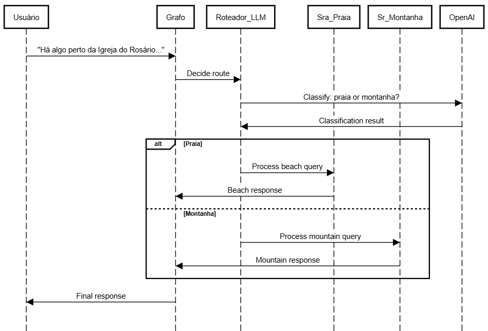

<<<<<<< HEAD

=======
\## 📊 Arquitetura do Grafo (Aula 4)

>>>>>>> b096ed0 (docs: atualiza README com diagrama da Aula 4)


Abaixo, o diagrama de sequência que detalha o fluxo de roteamento entre os consultores de Praia e Montanha, implementado com \*\*LangGraph\*\*:


!\[Fluxo de Sequência - LangGraph](./SD\_Langgraph.png)


> \*\*Nota:\*\* O fluxo utiliza lógica condicional para direcionar a query do usuário com base na análise do roteador.```

